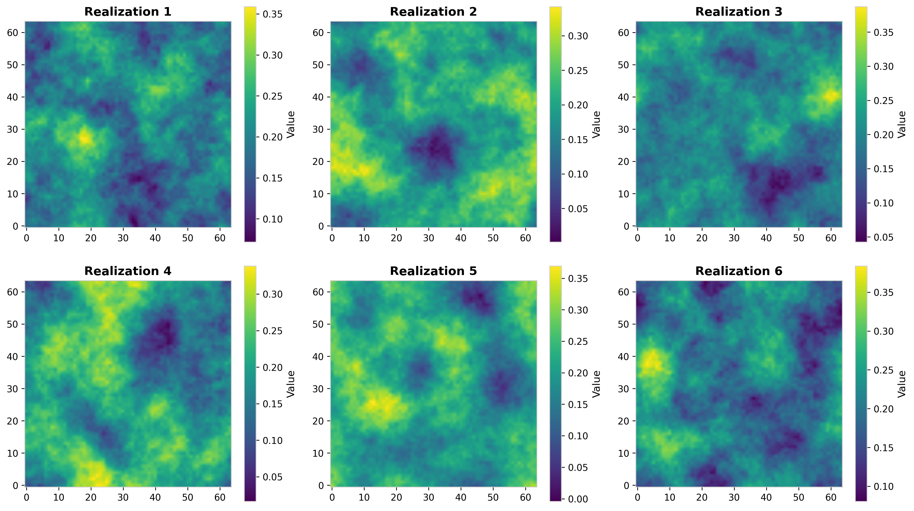
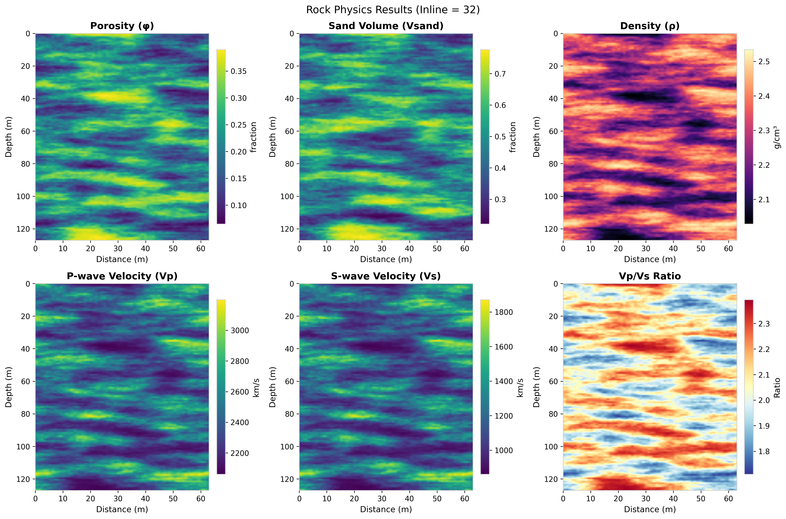
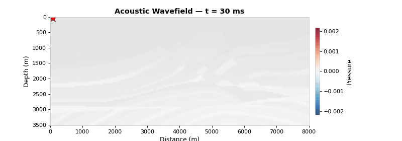
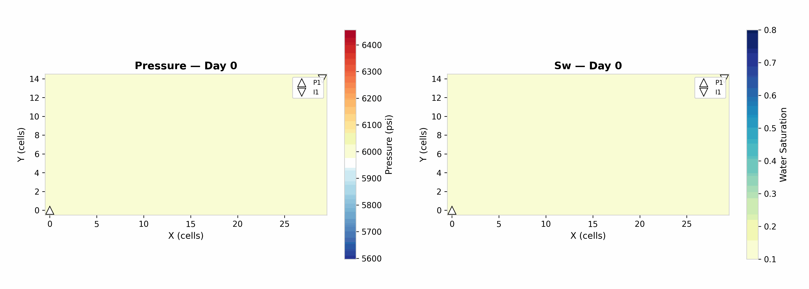
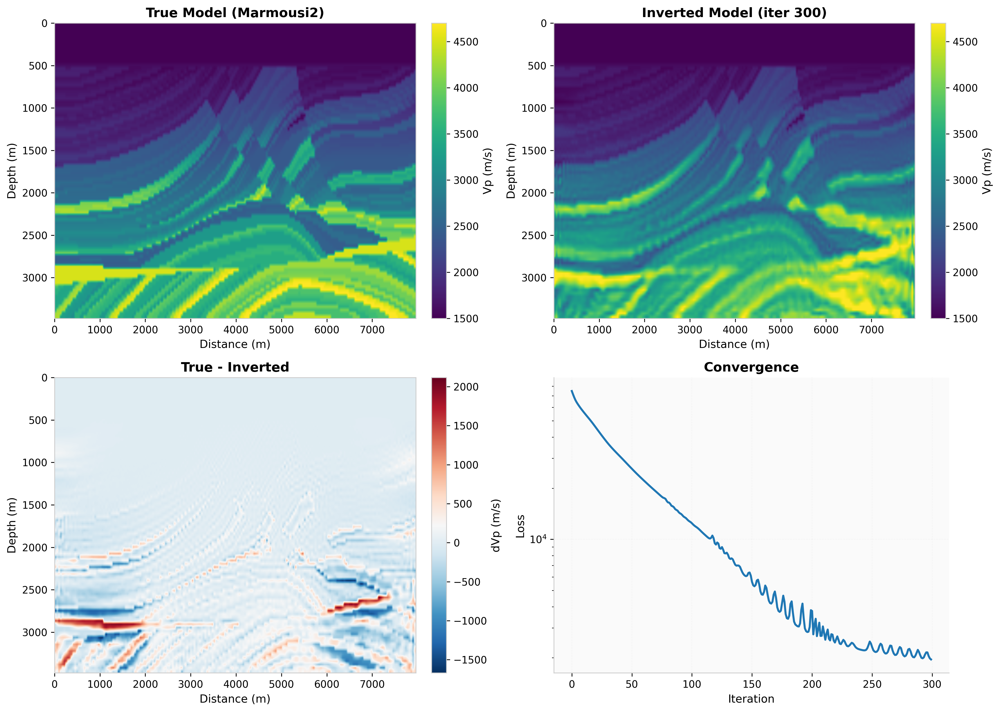
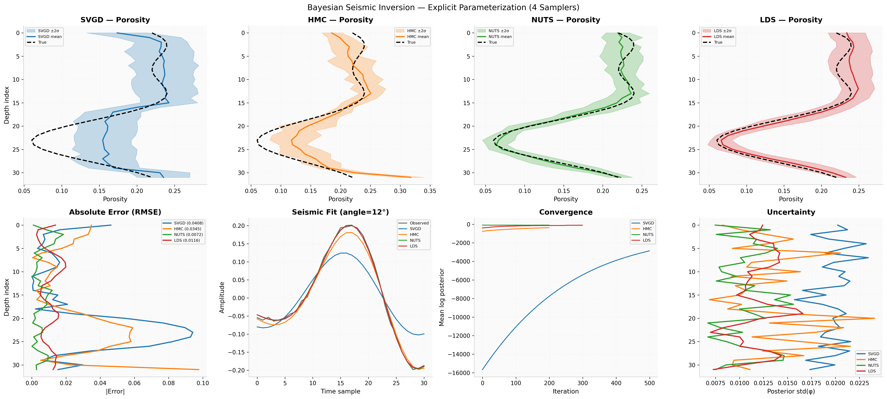

# Welcome to GeoBrain!

<div align="center">


[](https://www.python.org/)
[](https://pytorch.org/)
[](LICENSE)

</div>

## What is the GeoBrain Project?

**GeoBrain** is an open, modular, and extensible platform for **Geo**scientific **B**ayesian **R**easoning with **A**rtificial **In**telligence, designed specifically for **integrated subsurface modeling**.

By combining **differentiable physics**, **Bayesian inference**, and **deep learning**, GeoBrain enables end-to-end workflows for subsurface characterization, from geomodeling and rock physics to geophysical simulation and inversion. It supports both **explicit inversion** of physical parameters and **implicit inversion** using neural network reparameterizations, enabling flexible and geologically consistent modeling.

### Key Features

- **Differentiable Multiphysics Modeling**: Seamlessly integrates geostatistics, reservoir simulation, rock physics, and geophysics in a computational graph.
- **Automatic Differentiation**: Enables inversion without hand-crafted gradients -- PyTorch autograd flows through the entire forward chain.
- **Deep Neural Network Integration**: Incorporates neural networks for prior modeling (Deep Image Prior), surrogate modeling, latent space representations, and network-based reparameterizations.
- **Bayesian Gradient-Informed Samplers**: Four samplers (SVGD, HMC, NUTS, LDS) for rigorous uncertainty quantification.
- **70+ Rock Physics Models**: Effective medium theories, granular media models, fluid substitution, empirical relations, anisotropy, and resistivity.
- **Plug-and-Play Architecture**: Each physics module is self-contained and composable -- add new physics without rewriting core logic.
- **Real-World Applications**:
  - CO<sub>2</sub> storage site characterization at the **Illinois Basin -- Decatur Project (IBDP)**.
  - Joint seismic--resistivity inversion for the **Sleipner CCS site** in the Norwegian Sea.

---

## Gallery

<table>
<tr>
<td align="center"><b>Geostatistical Simulation</b><br></td>
<td align="center"><b>Rock Physics Modeling</b><br></td>
</tr>
<tr>
<td align="center"><b>Acoustic Wave Propagation</b><br></td>
<td align="center"><b>Reservoir Flow Simulation</b><br></td>
</tr>
<tr>
<td align="center"><b>Full Waveform Inversion</b><br></td>
<td align="center"><b>Bayesian AVO Inversion</b><br></td>
</tr>
</table>

---

## Installation

```bash
git clone https://github.com/minghuix98/GeoBrain.git
cd GeoBrain
pip install -e ".[all]"
```

**Requirements**: Python 3.9+, PyTorch 2.0+, NumPy >= 1.22, SciPy >= 1.8, Matplotlib >= 3.5

For DiffSim facies diffusion support, install the optional extra:

```bash
pip install -e ".[diffsim]"
```

DiffSim checkpoints are intentionally not tracked in git. Put local checkpoints under `checkpoints/diffsim/<case>/`, matching the paths in `configs/diffsim/*.json`. Compact DiffSim example data is provided as `examples/data/diffsim.zip` and is extracted by the same command below.

### Example Data

Some examples (Marmousi2, IBDP, Sleipner, etc.) require external data files. The data is included as zip files under `examples/data/`. Simply unzip them:

```bash
cd examples/data
unzip "*.zip"
```

After extraction the directory should look like:

```
examples/data/
├── marmousi/       # Marmousi2 velocity & density SEG-Y files
├── svgd/           # IBDP pretrained model & seismic data
├── multiphysics/   # Sleipner joint inversion data
├── diffsim/        # Compact DiffSim example data
└── pvt/            # PVT tables for flow simulation
```

---

## Quick Start

```python
import torch
from geobrain.geomodel import Simulator, SimulationConfig
from geobrain.physics.rock import SoftSand, Gassmann, DensityModel, v_from_moduli
from geobrain.physics.wave import RickerWavelet, compute_reflectivity, create_conv_matrix
from geobrain import InverseProblem, SVGD

# 1. Generate geological model
config = SimulationConfig(shape=(100, 200), lh=15.0, lv=5.0,
                          mean=0.25, std=0.05, seed=42)
porosity = Simulator.create("fft_ma").simulate(config)

# 2. Rock physics: porosity -> elastic properties
K_m, G_m = 36.6, 44.0          # Mineral moduli (GPa)
K_fl, rho_fl = 3.06, 1.08      # Fluid properties
rho_m = 2.65                    # Mineral density (g/cm3)

pressure = torch.ones_like(porosity) * 20.0
k_dry, g_dry = SoftSand()(K_m, G_m, porosity, 0.4, 7, pressure)
k_sat, g_sat = Gassmann()(k_dry, g_dry, K_m, K_fl, porosity)
rho = DensityModel()(porosity, rho_m, rho_fl)
vp, vs = v_from_moduli(k_sat, g_sat, rho)

# 3. Seismic forward modeling
refl = compute_reflectivity(vp[:-1], vs[:-1], rho[:-1],
                            vp[1:], vs[1:], rho[1:],
                            theta=[0], method='shuey')
wavelet, _ = RickerWavelet()(f0=25.0, dt=0.001)
W = create_conv_matrix(wavelet, refl.shape[-1])
seismic = refl @ W[len(wavelet)//2 : -(len(wavelet)//2)].T

# 4. Deterministic inversion
problem = InverseProblem(forward_fn=forward, observed=seismic, noise_std=0.01)
result = problem.create_inverter(initial_model=m0).run(problem.observed, max_epochs=200)

# 5. Bayesian uncertainty quantification
posterior = problem.as_posterior(log_prior=my_prior)
samples = SVGD(target=posterior).run(n_samples=50, n_steps=500)
```

---

## Project Structure

```
geobrain/
├── core/              # InverseProblem, registry system
├── geomodel/          # Geological model generation
│   ├── geostats/      # FFT-MA, SGS, variograms
│   ├── implicit/      # Differentiable implicit modeling
│   └── geogen/        # GAN, VAE, Diffusion generators
├── physics/           # Multiphysics simulations
│   ├── rock/          # 70+ rock physics models
│   ├── wave/          # Acoustic & elastic propagation, AVO, wavelets
│   └── flow/          # Differentiable reservoir simulation
├── optim/             # Deterministic inversion (L-BFGS, Gauss-Newton)
├── bayes/             # Bayesian samplers (SVGD, HMC, NUTS, LDS)
├── nn/                # Neural network components (Bayesian layers)
├── data/              # Data loading and transforms
├── io/                # SEG-Y, LAS, Eclipse grid I/O
├── vis/               # Visualization utilities
└── decision/          # Decision-making under uncertainty

examples/
├── 01_geomodel_sim.py ... 18_diffsim_3d_facies.py    # Python scripts
├── notebooks/         # Matching Jupyter notebooks for all examples
├── figs/              # Generated figures and animations
└── data/              # External datasets (see Installation)
```

---

## Tutorials

We provide 18 end-to-end examples covering geomodeling, multiphysics simulation, deterministic inversion, Bayesian inference, and DiffSim facies diffusion. Each example is available as both a **Python script** (`examples/`) and an interactive **Jupyter notebook** (`examples/notebooks/`).

| # | Example | Description |
|---|---------|-------------|
| 01 | [geomodel_sim](examples/01_geomodel_sim.py) | Geostatistical simulation with FFT-MA |
| 02 | [geomodel_cosim](examples/02_geomodel_cosim.py) | Co-simulation, SGS & variograms |
| 03 | [implicit_modeling](examples/03_implicit_modeling.py) | Implicit geological modeling |
| 04 | [implicit_inversion](examples/04_implicit_inversion.py) | Karst cave detection via implicit model inversion |
| 05 | [rock_physics](examples/05_rock_physics.py) | Rock physics modeling workflows |
| 06 | [seismic_avo_forward](examples/06_seismic_avo_forward.py) | AVO forward modeling |
| 07 | [acoustic_forward](examples/07_acoustic_forward.py) | 2D acoustic wave propagation (Marmousi2) |
| 08 | [elastic_forward](examples/08_elastic_forward.py) | 2D elastic wave propagation (Marmousi2) |
| 09 | [acoustic_fwi](examples/09_acoustic_fwi.py) | Acoustic full waveform inversion |
| 10 | [flow_simulation](examples/10_flow_simulation.py) | Oil-water two-phase flow simulation |
| 11 | [flow_dynamic_wells](examples/11_flow_dynamic_wells.py) | Dynamic well control & scheduling |
| 12 | [seismic_inversion](examples/12_seismic_inversion.py) | Deterministic inversion (3 parameterizations) |
| 13 | [bayes_avo_inversion](examples/13_bayes_avo_inversion.py) | Bayesian AVO inversion (4 samplers) |
| 14 | [ibdp_inversion_svgd](examples/14_ibdp_inversion_svgd.py) | IBDP CO<sub>2</sub> site -- latent-space SVGD |
| 15 | [sleipner_joint_inv](examples/15_sleipner_joint_inv.py) | Sleipner CO<sub>2</sub> -- joint seismic-resistivity inversion |
| 16 | [diffsim_2d_channel](examples/16_diffsim_2d_channel.py) | DiffSim 2D channel facies generation and inpainting |
| 17 | [diffsim_2d_muddrape](examples/17_diffsim_2d_muddrape.py) | DiffSim 2D mud-drape facies generation and inpainting |
| 18 | [diffsim_3d_facies](examples/18_diffsim_3d_facies.py) | DiffSim 3D facies generation and inpainting |

---

## Module Highlights

### Geological Modeling (`geobrain.geomodel`)

| Method | Description                                                                           |
|--------|---------------------------------------------------------------------------------------|
| FFT-MA | Fast spectral-domain Gaussian simulation for large 2D/3D grids                        |
| SGS | Sequential Gaussian Simulation with Simple/Ordinary Kriging; conditional on well data |
| Co-simulation | Multi-variable correlated fields (e.g., porosity + sand volume) via `CoSimConfig`     |
| Variogram | Composite variogram models (spherical, exponential, Gaussian) via `VariogramModel`    |
| Implicit Modeling | Differentiable Geomodeling                                                            |
| VAE / GAN / Diffusion / DiffSim | Deep generative models for realistic geological facies generation                     |

### Rock Physics (`geobrain.physics.rock`) — 70+ models

| Category | Models |
|----------|--------|
| Effective medium | VRH, Hashin-Shtrikman, DEM, Self-Consistent, Critical Porosity, Hudson, Eshelby-Cheng |
| Granular media | Hertz-Mindlin, SoftSand, StiffSand, ContactCement, Walton, MUHS, PCM, Digby, Thomas-Stieber |
| Fluid substitution | Gassmann (forward & inverse), Wood, Brie, Batzle-Wang, Biot, CO<sub>2</sub>-Brine, Brown-Korringa |
| Empirical | Gardner, Han, Castagna, Krief, Raymer-Hunt, Storvoll, Japsen, Hillis |
| Anisotropy | Thomsen (VTI/HTI), Backus averaging, Bond transform |
| Permeability | Kozeny-Carman, Owolabi, Panda-Lake, Revil, Fredrich, Bloch, Bernabe |
| Resistivity | Archie's law |
| QI | Rock Physics Template (RPT), screening, cement estimation |

Built-in **MINERALS** and **FLUIDS** databases, plus `RockPhysicsWorkflow` presets for common scenarios.

### Wave Physics (`geobrain.physics.wave`)

| Component | Details |
|-----------|---------|
| Propagators | 2D/3D acoustic & elastic FDTD solvers with gradient checkpointing |
| AVO | Zoeppritz (exact), Aki-Richards (4-term), Shuey (3-term + AVO attributes) |
| Wavelets | Ricker, Gaussian, Ormsby, Klauder — class-based and functional APIs |
| Survey | Source, Receiver, Survey geometry management; SeismicData container |
| Convolution | `convolve_trace`, `convolve_gather`, `apply_wavelet`, `create_conv_matrix` |
| Metrics | MSE, RMSE, MAPE, SNR |

### Flow Simulation (`geobrain.physics.flow`)

- **Two-phase** oil-water reservoir simulation on structured grids
- **Wells**: injection/production with rate or BHP control; dynamic scheduling (add, shut-in, restart)
- **PVT**: pressure-volume-temperature tables (PVDO, PVTW) or analytic models
- **Relative permeability**: Corey or tabular (SWOF)
- **Solver**: fully implicit Newton solver with adaptive time stepping
- **Differentiable**: gradients flow through the simulator for history matching

### Deterministic Inversion (`geobrain.optim`)

| Feature | Details |
|---------|---------|
| Parameterizations | Explicit (direct), Latent (autoencoder), Network (Deep Image Prior) |
| Optimizers | Adam, L-BFGS (Wolfe line search), Gauss-Newton |
| Losses | MSE, NRMSE, L1, Huber |
| Constraints | Bound (clamp), Clip (projection), Sigmoid (differentiable) |
| Regularizers | L2, L1 |
| Bridge | `InverseProblem` unifies deterministic and Bayesian solvers |

### Bayesian Inference (`geobrain.bayes`)

| Sampler | Method | Best For |
|---------|--------|----------|
| SVGD | Stein Variational Gradient Descent | Multi-modal posteriors, large ensembles |
| HMC | Hamiltonian Monte Carlo | High-dimensional with tuned step size |
| NUTS | No-U-Turn Sampler | Auto-tuned HMC |
| LDS | Langevin Dynamics (ULA/MALA) | Simple gradient-based sampling |

Distributions: `Gaussian`, `GaussianMixture`, `Posterior`. Kernels: `RBFKernel`, `IMQKernel` with adaptive bandwidth. Diagnostics: `mmd`, `energy_distance`.

### Neural Networks (`geobrain.nn`)

- **Bayesian layers**: `LinearFlipout`, `Conv2dFlipout`, `Conv3dFlipout` with KL divergence
- **Activations**: `ClippedLinearActivation` for bounded output

### I/O (`geobrain.io`)

| Format  | Functions |
|---------|-----------|
| SEG-Y   | `read_segy`, `write_segy`, `read_segy_volume` |
| LAS     | `read_las`, `write_las` (well log data) |
| Eclipse | `read_egrid`, `read_init`, `read_restart`, `read_summary` (reservoir grids) |

### Visualization (`geobrain.vis`)

- **Seismic**: `plot_section`, `plot_wiggle`, `plot_gather`
- **Fields**: `plot_field`, `plot_slices`, `plot_comparison`
- **Wells**: `plot_logs` (multi-track well log display)
- **Production**: `plot_production`, `plot_watercut`, `plot_well_summary`
- **Colormaps**: geophysics-specific colormaps (Seismic, Velocity, etc.)

### Data & Transforms (`geobrain.data`)

- Transforms: `Normalize`, `Clamp`, `Sigmoid`, `Logit`, `Log`, `Exp`, `Compose`
- Datasets: `SimpleTensorDataset`, `GeoDataset` for PyTorch data loading

### Decision Under Uncertainty (`geobrain.decision`)

- `ValueOfInformation`: Value of Perfect Information (VOPI) analysis for data acquisition planning
- `ClosedLoopManager`: closed-loop reservoir management (observe → update → decide)

---

## Acknowledgments

GeoBrain builds upon excellent open-source projects:

- **Seismic Reservoir Characterization**: Implementation inspired by [SeReM](https://github.com/seismicreservoirmodeling/SeReM) - Seismic Reservoir Modeling.
- **Rock Physics Module** (`geobrain.physics.rock`): Implementation inspired by [rockphypy](https://github.com/yujiaxin666/rockphypy) - Python Tool for Rock Physics.
- **Wave Propagation Module** (`geobrain.physics.wave`): Implementation inspired by [deepwave](https://github.com/ar4/deepwave) - Differentiable Finite-Difference Wave Propagation, and [ADFWI](https://github.com/liufeng2317/ADFWI) - Automatic Differentiation Full Waveform Inversion based on PyTorch.
- **Flow Simulation Module** (`geobrain.physics.flow`): Implementation inspired by [ResSimAD.jl](https://github.com/DeanLym/ResSimAD.jl) - Differentiable Reservoir Simulation in Julia.
- **Implicit Geological Modeling** (`geobrain.geomodel.implicit`): Implementation inspired by [GemPy](https://github.com/cgre-aachen/gempy) - Open-Source Implicit Geological Modeling in Python.

We thank the authors of these projects for their contributions to the open-source geoscience community.

---

## Citation

If you use GeoBrain in your research, please cite:

```bibtex
@software{GeoBrain2026,
  title = {GeoBrain: An End-to-End Differentiable Platform for Integrated Subsurface Modeling},
  author = {Liu, Mingliang},
  year = {2026},
  url = {https://github.com/minghuix98/GeoBrain}
}
```

---

## License

This project is licensed under the Apache License 2.0 - see the [LICENSE](LICENSE) file for details.

---

## Contact

- **Author**: Mingliang Liu
- **Email**: mingliangliu@sdu.edu.cn
